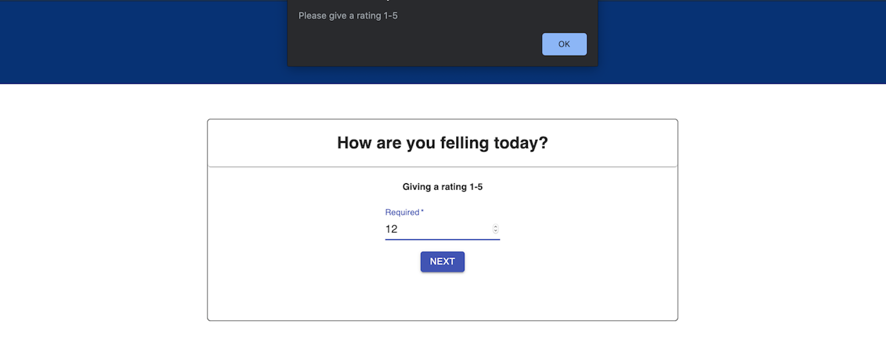
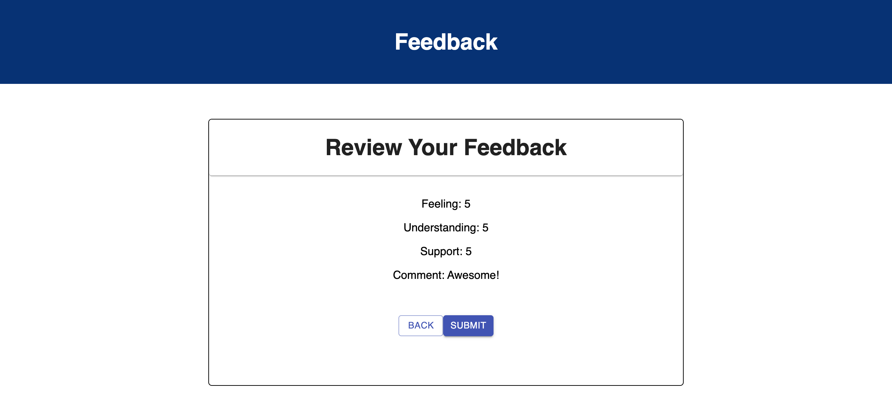
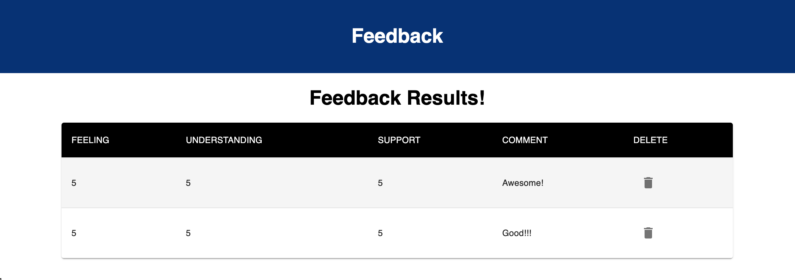

# Project Name
Feedback 
## Description

  Create an app that allows the user to send feedback to the database. And as the admin, I can see what the user input from a link address named Admin. 

  To moving between components, I use HashRouter and assign links to NEXT buttons.

  To connect the client-side with the server-side. Via Axios, I make the GET repost and POST to get the data as well as send the data. And also through Axios, I create a DELETE request to delete the specific feedback by its id. 

## Screen shot

## Installation
1. Create a database named your database name,
2. The queries in the tables.sql file are set up to create all the necessary tables and populate the needed data to allow the application to run correctly. The project is built on Postgres, so you will need to make sure to have that installed. We recommend using Postico to run those queries as that was used to create the queries,
3. Open up your editor of choice and run an npm install
4. Run npm run server in your terminal
5. Run npm run client in your terminal
6. The npm run client command will open up a new browser tab for you!

## Built With

HTML, CSS, React, Redux, SQL, JSON, Node.js, Postico(database), Material-UI, SweetAlert2

## Acknowledgement

Thanks to Prime Digital Academy who equipped and helped me to make this application a reality.

## Support

If you have suggestions or issues, please email me at thuvu0411@gmail.com
  

